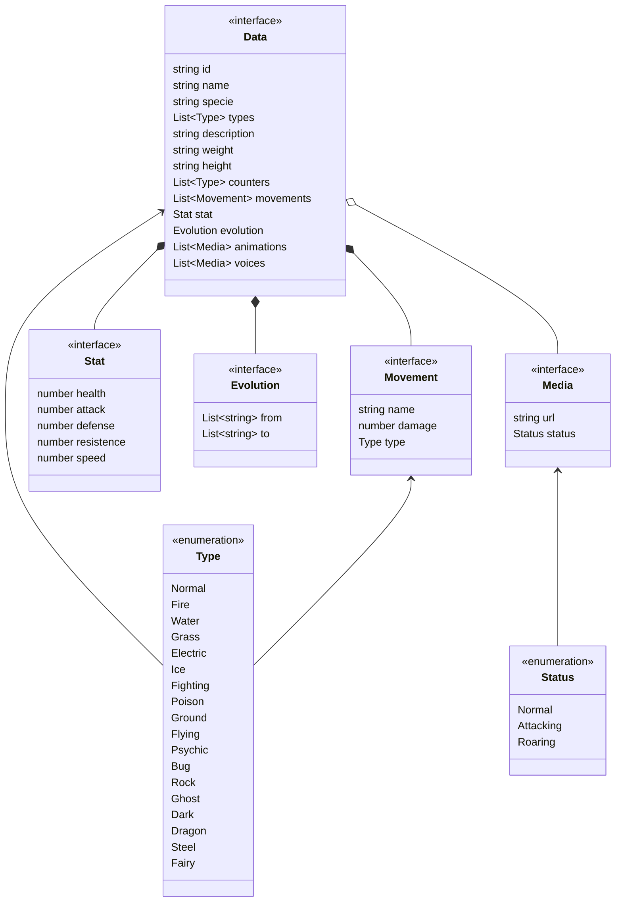

<!--
Created: Sat Jun 11 2022 14:58:50 GMT-0400 (hora de Bolivia)
Modified: Sat Jun 11 2022 14:58:50 GMT-0400 (hora de Bolivia)
-->

# Pikapi

An open RESTful API for simple Pokémon data

## Data Model

**Namespace**: Pokemon

## References

* [https://www.pkparaiso.com/pokedex/bulbasaur.php](https://www.pkparaiso.com/pokedex/bulbasaur.php)
* [https://www.pokemon.com/es/pokedex/bulbasaur](https://www.pokemon.com/es/pokedex/bulbasaur)
* [https://pokemon.fandom.com/es/wiki/Bulbasaur](https://pokemon.fandom.com/es/wiki/Bulbasaur)
* [https://pokemon.fandom.com/wiki/Bulbasaur](https://pokemon.fandom.com/wiki/Bulbasaur)
* [https://pokemon.gameinfo.io/en/pokemon/1-bulbasaur](https://pokemon.gameinfo.io/en/pokemon/1-bulbasaur)
